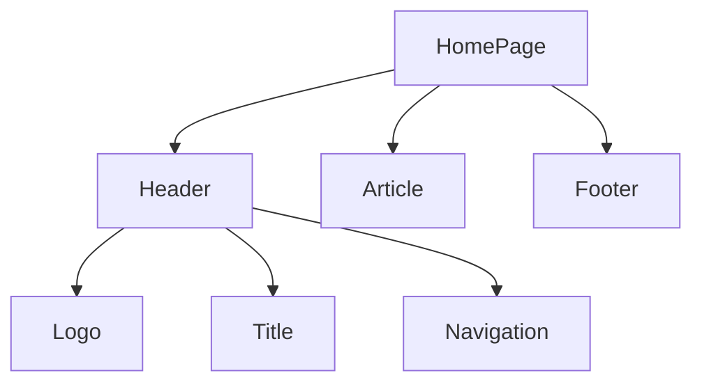

# Building UI with Components / Xây dựng giao diện với Components

---

**📅 Created / Ngày tạo:** 2025-12-27  
**📅 Last Updated / Ngày cập nhật:** 2025-12-27

**⬅️ Previous / Bài trước:** [Getting Started with React](./react_getting_started_with_react.md)  
**➡️ Next / Bài sau:** [Displaying Data with Props](./react_props.md)

---

## Description / Mô tả

This lesson introduces the core concept of Components in React. You will learn how user interfaces can be broken down into smaller, reusable building blocks called components. Components are JavaScript functions that return UI elements, allowing you to build modular, maintainable applications. You'll explore how to create components, nest them to form component trees, and understand the fundamental structure that makes React applications scalable and organized.

Bài học này giới thiệu khái niệm cốt lõi về Components trong React. Bạn sẽ học cách giao diện người dùng có thể được chia nhỏ thành các khối xây dựng nhỏ hơn, có thể tái sử dụng được gọi là components. Components là các hàm JavaScript trả về các phần tử giao diện, cho phép bạn xây dựng các ứng dụng có tính module và dễ bảo trì. Bạn sẽ khám phá cách tạo components, lồng chúng để tạo thành cây components, và hiểu cấu trúc cơ bản giúp ứng dụng React có khả năng mở rộng và tổ chức tốt.

---

## Main Concepts / Khái niệm chính

### Components as Building Blocks / Components như các khối xây dựng

Components allow you to break down user interfaces into smaller, self-contained, reusable pieces of code. Think of components as LEGO bricks - you can combine individual bricks to form larger structures. This modularity makes your code more maintainable as it grows.

Components cho phép bạn chia nhỏ giao diện người dùng thành các đoạn code nhỏ hơn, độc lập và có thể tái sử dụng. Hãy nghĩ về components như các viên gạch LEGO - bạn có thể kết hợp các viên gạch riêng lẻ để tạo thành các cấu trúc lớn hơn. Tính module này làm cho code của bạn dễ bảo trì hơn khi nó phát triển.

```jsx
// Simple component example / Ví dụ component đơn giản
function Header() {
    // Components are just JavaScript functions / Components chỉ là các hàm JavaScript
    // They return UI elements (JSX) / Chúng trả về các phần tử giao diện (JSX)
    return <h1>Develop. Preview. Ship.</h1>;
}
```

### Creating Components / Tạo Components

In React, components are functions that return JSX (UI elements). Component names must be capitalized to distinguish them from regular HTML elements and JavaScript functions. When you want to use a component, you treat it like an HTML tag with angle brackets `<ComponentName />`.

Trong React, components là các hàm trả về JSX (các phần tử giao diện). Tên components phải được viết hoa chữ cái đầu để phân biệt chúng với các phần tử HTML thông thường và các hàm JavaScript. Khi bạn muốn sử dụng một component, bạn coi nó như một thẻ HTML với dấu ngoặc nhọn `<ComponentName />`.

```jsx
// Define a component / Định nghĩa một component
function Header() {
    return <h1>Develop. Preview. Ship.</h1>;
}

// Get the DOM element / Lấy phần tử DOM
const app = document.getElementById('app');

// Create React root / Tạo React root
const root = ReactDOM.createRoot(app);

// Render the component / Hiển thị component
// Use angle brackets like HTML tags / Sử dụng dấu ngoặc nhọn như thẻ HTML
root.render(<Header />);
```

### Nesting Components / Lồng Components

Applications usually include more content than a single component. You can nest React components inside each other just like regular HTML elements. This creates a hierarchical structure where parent components can contain child components.

Các ứng dụng thường bao gồm nhiều nội dung hơn một component đơn lẻ. Bạn có thể lồng các components React vào nhau giống như các phần tử HTML thông thường. Điều này tạo ra một cấu trúc phân cấp trong đó các components cha có thể chứa các components con.

```jsx
// Parent component / Component cha
function Header() {
    return <h1>Develop. Preview. Ship.</h1>;
}

// Another parent component that nests Header / Component cha khác lồng Header
function HomePage() {
    return (
        <div>
            {/* Nesting the Header component / Lồng component Header */}
            <Header />
        </div>
    );
}

// Render the top-level component / Hiển thị component cấp cao nhất
const root = ReactDOM.createRoot(app);
root.render(<HomePage />);
```

### Component Trees / Cây Components

You can continue nesting components to form component trees. For example, a top-level `HomePage` component could contain a `Header`, an `Article`, and a `Footer` component. Each of those components could have their own child components. For instance, the `Header` component might contain a `Logo`, `Title`, and `Navigation` component.

Bạn có thể tiếp tục lồng các components để tạo thành cây components. Ví dụ, một component cấp cao nhất `HomePage` có thể chứa các component `Header`, `Article`, và `Footer`. Mỗi component đó lại có thể có các component con riêng. Chẳng hạn, component `Header` có thể chứa các component `Logo`, `Title`, và `Navigation`.

```jsx
// Child components / Components con
function Logo() {
    return ;
}

function Title() {
    return <h1>My Website</h1>;
}

function Navigation() {
    return (
        <nav>
            <a href="/">Home</a>
            <a href="/about">About</a>
        </nav>
    );
}

// Parent component using child components / Component cha sử dụng components con
function Header() {
    return (
        <header>
            <Logo />
            <Title />
            <Navigation />
        </header>
    );
}

function Article() {
    return <article>Main content here</article>;
}

function Footer() {
    return <footer>© 2025 My Website</footer>;
}

// Top-level component / Component cấp cao nhất
function HomePage() {
    return (
        <div>
            {/* Component tree structure / Cấu trúc cây component */}
            <Header />
            <Article />
            <Footer />
        </div>
    );
}

// Render the entire tree / Hiển thị toàn bộ cây
const root = ReactDOM.createRoot(app);
root.render(<HomePage />);
```



---

## Benefits/Applications / Lợi ích/Ứng dụng

### Benefits / Lợi ích

- **Reusability / Tính tái sử dụng**: Components can be reused across different parts of your application, reducing code duplication. / Components có thể được tái sử dụng trong các phần khác nhau của ứng dụng, giảm thiểu việc lặp lại code.
- **Maintainability / Tính bảo trì**: You can update, add, or delete specific components without affecting the rest of the application. / Bạn có thể cập nhật, thêm hoặc xóa các components cụ thể mà không ảnh hưởng đến phần còn lại của ứng dụng.
- **Modularity / Tính module**: Breaking down UI into smaller pieces makes the codebase more organized and easier to understand. / Chia nhỏ giao diện thành các phần nhỏ hơn làm cho codebase có tổ chức hơn và dễ hiểu hơn.
- **Scalability / Khả năng mở rộng**: Component-based architecture allows applications to grow without becoming unmanageable. / Kiến trúc dựa trên component cho phép ứng dụng phát triển mà không trở nên khó quản lý.
- **Collaboration / Cộng tác**: Different team members can work on different components simultaneously without conflicts. / Các thành viên trong nhóm có thể làm việc trên các components khác nhau cùng lúc mà không xung đột.

### Real-world Applications / Ứng dụng thực tế

- **Navigation Headers / Thanh điều hướng**: Create reusable header components with logos, menus, and search bars that appear on multiple pages. / Tạo các components header có thể tái sử dụng với logo, menu và thanh tìm kiếm xuất hiện trên nhiều trang.
- **Product Cards / Thẻ sản phẩm**: Build product card components that can be reused in listings, shopping carts, and recommendation sections. / Xây dựng các components thẻ sản phẩm có thể được tái sử dụng trong danh sách, giỏ hàng và phần gợi ý.
- **Form Elements / Các phần tử biểu mẫu**: Design reusable form components like text inputs, buttons, and dropdowns for consistent user experience. / Thiết kế các components biểu mẫu có thể tái sử dụng như ô nhập văn bản, nút bấm và menu thả xuống để có trải nghiệm người dùng nhất quán.
- **Dashboard Widgets / Widget bảng điều khiển**: Create modular dashboard components such as charts, statistics cards, and activity feeds that can be arranged flexibly. / Tạo các components bảng điều khiển có tính module như biểu đồ, thẻ thống kê và nguồn cấp hoạt động có thể được sắp xếp linh hoạt.
- **Modal Dialogs / Hộp thoại Modal**: Build reusable modal components for confirmations, forms, and notifications throughout the application. / Xây dựng các components modal có thể tái sử dụng cho xác nhận, biểu mẫu và thông báo trong toàn bộ ứng dụng.

---

## Complete Example / Ví dụ hoàn chỉnh

```jsx
// Complete example of component-based UI / Ví dụ hoàn chỉnh về giao diện dựa trên component
<!DOCTYPE html>
<html>
<head>
    <title>React Components Example</title>
    <!-- Load React and ReactDOM / Tải React và ReactDOM -->
    <script src="https://unpkg.com/react@18/umd/react.development.js"></script>
    <script src="https://unpkg.com/react-dom@18/umd/react-dom.development.js"></script>
    <!-- Load Babel to compile JSX / Tải Babel để biên dịch JSX -->
    <script src="https://unpkg.com/@babel/standalone/babel.min.js"></script>
</head>
<body>
    <!-- Container for React app / Container cho ứng dụng React -->
    <div id="app"></div>

    <script type="text/jsx">
        // Button component / Component nút bấm
        function LikeButton() {
            return <button>Like (0)</button>;
        }

        // Header component / Component tiêu đề
        function Header() {
            return <h1>Team Members</h1>;
        }

        // List item component / Component mục danh sách
        function MemberList() {
            return (
                <ul>
                    <li>Ada Lovelace</li>
                    <li>Grace Hopper</li>
                    <li>Margaret Hamilton</li>
                </ul>
            );
        }

        // Main page component / Component trang chính
        function HomePage() {
            return (
                <div>
                    {/* Nested components / Components lồng nhau */}
                    <Header />
                    <MemberList />
                    <LikeButton />
                </div>
            );
        }

        // Get container and render / Lấy container và hiển thị
        const app = document.getElementById('app');
        const root = ReactDOM.createRoot(app);
        root.render(<HomePage />);
    </script>
</body>
</html>
```

---

## Best Practices / Thực hành tốt nhất

- ✅ **DO**: Always capitalize component names to distinguish them from HTML elements. / Luôn viết hoa chữ cái đầu tiên của tên component để phân biệt chúng với các phần tử HTML.
- ✅ **DO**: Keep components small and focused on a single responsibility. / Giữ components nhỏ và tập trung vào một trách nhiệm duy nhất.
- ✅ **DO**: Use descriptive names that clearly indicate what the component does. / Sử dụng tên mô tả rõ ràng về chức năng của component.
- ✅ **DO**: Organize related components together in folders. / Tổ chức các components liên quan cùng nhau trong các thư mục.
- ❌ **DON'T**: Create overly complex components with too many responsibilities. / Không tạo các components quá phức tạp với quá nhiều trách nhiệm.
- ❌ **DON'T**: Use lowercase names for React components. / Không sử dụng tên viết thường cho các components React.
- ❌ **DON'T**: Render components directly as functions without JSX syntax. / Không hiển thị components trực tiếp như các hàm mà không có cú pháp JSX.

---

## Common Mistakes / Lỗi thường gặp

### Error 1: Lowercase Component Name

**Description**: Using lowercase names for React components causes them to be treated as HTML tags instead of React components. / Sử dụng tên viết thường cho các components React khiến chúng bị coi là thẻ HTML thay vì components React.

**Solution**: Always capitalize the first letter of component names. / Luôn viết hoa chữ cái đầu tiên của tên component.

```jsx
// ❌ Wrong / Sai
function header() {
    return <h1>Title</h1>;
}
root.render(<header />); // Treated as HTML <header> tag

// ✅ Correct / Đúng
function Header() {
    return <h1>Title</h1>;
}
root.render(<Header />); // Treated as React component
```

### Error 2: Calling Component as Function

**Description**: Calling components as regular functions instead of using JSX syntax breaks React's component lifecycle. / Gọi components như các hàm thông thường thay vì sử dụng cú pháp JSX phá vỡ vòng đời của component React.

**Solution**: Always use JSX syntax with angle brackets `<Component />`. / Luôn sử dụng cú pháp JSX với dấu ngoặc nhọn `<Component />`.

```jsx
// ❌ Wrong / Sai
root.render(Header); // Passes function reference, doesn't execute

// ✅ Correct / Đúng
root.render(<Header />); // Renders the component using JSX
```

---

## References / Tài liệu tham khảo

- [Next.js: Building UI with Components](https://nextjs.org/learn/react-foundations/building-ui-with-components)
- [React Documentation: Your First Component](https://react.dev/learn/your-first-component)
- [React Documentation: Importing and Exporting Components](https://react.dev/learn/importing-and-exporting-components)
