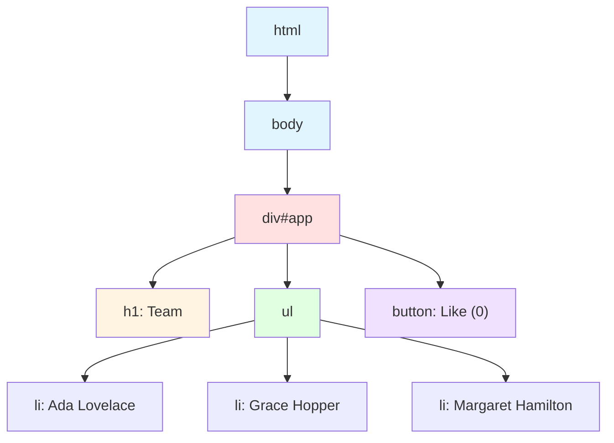

# Rendering User Interfaces (UI) / Hiển thị Giao diện Người dùng

---

**📅 Created / Ngày tạo:** 2025-12-27  
**📅 Last Updated / Ngày cập nhật:** 2025-12-27

**⬅️ Previous / Bài trước:** [What is React and Next.js?](./react_what_is_react_and_nextjs.md)  
**➡️ Next / Bài sau:** [Updating UI with Javascript](./react_updating_ui_with_javascript.md)

---

## Description / Mô tả

This lesson explores the fundamentals of how browsers render user interfaces. You will learn about the Document Object Model (DOM), how browsers transform HTML into interactive web pages, and the relationship between your code and what users see on screen. Understanding how browsers interpret and render HTML is essential before learning React, as React builds upon these fundamental concepts to create dynamic, efficient user interfaces.

Bài học này khám phá các nguyên tắc cơ bản về cách trình duyệt hiển thị giao diện người dùng. Bạn sẽ tìm hiểu về Document Object Model (DOM), cách trình duyệt chuyển đổi HTML thành các trang web tương tác, và mối quan hệ giữa code của bạn và những gì người dùng nhìn thấy trên màn hình. Hiểu cách trình duyệt diễn giải và hiển thị HTML là rất quan trọng trước khi học React, vì React xây dựng dựa trên các khái niệm cơ bản này để tạo ra giao diện người dùng động và hiệu quả.

---

## Main Concepts / Khái niệm chính

### How Browsers Render Web Pages / Cách Trình duyệt Hiển thị Trang Web

When a user visits a web page, the browser goes through a process to transform HTML code into a visual interface. Understanding this process is fundamental to web development.

Khi người dùng truy cập một trang web, trình duyệt trải qua một quá trình để chuyển đổi code HTML thành giao diện trực quan. Hiểu quá trình này là nền tảng cho phát triển web.

**The Rendering Process / Quá trình Hiển thị:**

1. **User requests a page / Người dùng yêu cầu một trang**: Browser sends request to server / Trình duyệt gửi yêu cầu đến server
2. **Server returns HTML / Server trả về HTML**: Server sends HTML file to browser / Server gửi file HTML cho trình duyệt
3. **Browser parses HTML / Trình duyệt phân tích HTML**: Browser reads and interprets the HTML / Trình duyệt đọc và diễn giải HTML
4. **Browser constructs DOM / Trình duyệt xây dựng DOM**: Browser creates DOM tree structure / Trình duyệt tạo cấu trúc cây DOM
5. **Browser renders UI / Trình duyệt hiển thị giao diện**: Browser displays the visual interface / Trình duyệt hiển thị giao diện trực quan

```html
<!-- Example HTML returned by server / HTML ví dụ được server trả về -->
<!DOCTYPE html>
<html>
<head>
    <title>My Page</title>
</head>
<body>
    <div id="app">
        <h1>Welcome!</h1>
        <p>This is my webpage.</p>
    </div>
</body>
</html>
```

### What is the DOM? / DOM là gì?

The DOM (Document Object Model) is an object representation of the HTML elements on your web page. It acts as a bridge between your code and the user interface, providing a structured way to access and manipulate web page content.

DOM (Document Object Model) là một biểu diễn đối tượng của các phần tử HTML trên trang web của bạn. Nó hoạt động như một cầu nối giữa code của bạn và giao diện người dùng, cung cấp một cách có cấu trúc để truy cập và thao tác nội dung trang web.

**Key Characteristics of the DOM / Đặc điểm chính của DOM:**

- **Object-oriented / Hướng đối tượng**: Each element is an object with properties and methods / Mỗi phần tử là một đối tượng với thuộc tính và phương thức
- **Tree structure / Cấu trúc cây**: Organized hierarchically with parent-child relationships / Được tổ chức theo cấp bậc với quan hệ cha-con
- **Live representation / Biểu diễn trực tiếp**: Changes to DOM immediately reflect in the UI / Thay đổi DOM phản ánh ngay lập tức trong giao diện
- **Language-independent / Độc lập ngôn ngữ**: Can be manipulated with JavaScript and other languages / Có thể được thao tác bằng JavaScript và các ngôn ngữ khác

```html
<!-- HTML Code / Code HTML -->
<html>
  <body>
    <div id="app">
      <h1>Team</h1>
      <ul>
        <li>Ada Lovelace</li>
        <li>Grace Hopper</li>
        <li>Margaret Hamilton</li>
      </ul>
      <button>Like (0)</button>
    </div>
  </body>
</html>
```

The browser transforms this HTML into a DOM tree structure:

Trình duyệt chuyển đổi HTML này thành cấu trúc cây DOM:

```
DOM Tree Structure / Cấu trúc cây DOM:

html
└── body
    └── div (id="app")
        ├── h1 ("Team")
        ├── ul
        │   ├── li ("Ada Lovelace")
        │   ├── li ("Grace Hopper")
        │   └── li ("Margaret Hamilton")
        └── button ("Like (0)")
```

**Visual Diagram / Sơ đồ trực quan:**



### DOM Methods / Phương thức DOM

JavaScript provides DOM methods that allow you to select, create, update, and delete elements in the DOM, enabling dynamic manipulation of the user interface.

JavaScript cung cấp các phương thức DOM cho phép bạn chọn, tạo, cập nhật và xóa các phần tử trong DOM, cho phép thao tác động giao diện người dùng.

**Common DOM Methods / Các phương thức DOM phổ biến:**

```javascript
// 1. SELECTING ELEMENTS / CHỌN PHẦN TỬ

// Select by ID / Chọn theo ID
const app = document.getElementById('app');

// Select by class name / Chọn theo tên class
const buttons = document.getElementsByClassName('btn');

// Select by tag name / Chọn theo tên thẻ
const paragraphs = document.getElementsByTagName('p');

// Select with CSS selector / Chọn với selector CSS
const element = document.querySelector('#app .title');
const elements = document.querySelectorAll('.item');
```

```javascript
// 2. CREATING ELEMENTS / TẠO PHẦN TỬ

// Create new element / Tạo phần tử mới
const header = document.createElement('h1');

// Create text node / Tạo nút văn bản
const text = document.createTextNode('Welcome!');

// Set content directly / Đặt nội dung trực tiếp
header.textContent = 'Develop. Preview. Ship.';
header.innerHTML = '<span>Welcome!</span>';
```

```javascript
// 3. ADDING ELEMENTS / THÊM PHẦN TỬ

// Append as last child / Thêm như con cuối cùng
app.appendChild(header);

// Insert before an element / Chèn trước một phần tử
app.insertBefore(newElement, referenceElement);

// Append multiple elements at once / Thêm nhiều phần tử cùng lúc
app.append(element1, element2, element3);
```

```javascript
// 4. UPDATING ELEMENTS / CẬP NHẬT PHẦN TỬ

// Change text content / Thay đổi nội dung văn bản
header.textContent = 'New Title';

// Change HTML content / Thay đổi nội dung HTML
header.innerHTML = '<strong>Bold Title</strong>';

// Modify attributes / Sửa đổi thuộc tính
header.setAttribute('class', 'title');
header.classList.add('active');
header.classList.remove('inactive');

// Change styles / Thay đổi kiểu dáng
header.style.color = 'blue';
header.style.fontSize = '24px';
```

```javascript
// 5. REMOVING ELEMENTS / XÓA PHẦN TỬ

// Remove element / Xóa phần tử
header.remove();

// Remove child element / Xóa phần tử con
app.removeChild(header);
```

### Complete DOM Manipulation Example / Ví dụ hoàn chỉnh Thao tác DOM

```html
<!DOCTYPE html>
<html>
<head>
    <title>DOM Manipulation Example</title>
    <style>
        body {
            font-family: Arial, sans-serif;
            max-width: 600px;
            margin: 50px auto;
            padding: 20px;
        }
        h1 {
            color: #0070f3;
        }
        .highlight {
            background-color: yellow;
        }
    </style>
</head>
<body>
    <!-- Container / Container -->
    <div id="app"></div>
    
    <script>
        // Step 1: Select the container / Bước 1: Chọn container
        const app = document.getElementById('app');
        
        // Step 2: Create header element / Bước 2: Tạo phần tử header
        const header = document.createElement('h1');
        const headerText = document.createTextNode('Develop. Preview. Ship. 🚀');
        header.appendChild(headerText);
        
        // Step 3: Create list / Bước 3: Tạo danh sách
        const list = document.createElement('ul');
        const names = ['Ada Lovelace', 'Grace Hopper', 'Margaret Hamilton'];
        
        // Step 4: Add list items / Bước 4: Thêm các mục danh sách
        names.forEach(name => {
            const listItem = document.createElement('li');
            listItem.textContent = name;
            list.appendChild(listItem);
        });
        
        // Step 5: Create button / Bước 5: Tạo nút
        const button = document.createElement('button');
        button.textContent = 'Click me!';
        button.onclick = function() {
            header.classList.toggle('highlight');
        };
        
        // Step 6: Add all to DOM / Bước 6: Thêm tất cả vào DOM
        app.appendChild(header);
        app.appendChild(list);
        app.appendChild(button);
    </script>
</body>
</html>
```

### Listening to User Events / Lắng nghe Sự kiện Người dùng

DOM methods also allow you to listen to user events and respond to interactions. This makes your web pages interactive.

Các phương thức DOM cũng cho phép bạn lắng nghe các sự kiện người dùng và phản hồi các tương tác. Điều này làm cho trang web của bạn tương tác.

```javascript
// Click events / Sự kiện nhấp chuột
button.addEventListener('click', function() {
    console.log('Button clicked!');
});

// Input events / Sự kiện nhập liệu
input.addEventListener('input', function(event) {
    console.log('User typed:', event.target.value);
});

// Mouse events / Sự kiện chuột
element.addEventListener('mouseover', function() {
    element.style.backgroundColor = 'lightblue';
});

// Keyboard events / Sự kiện bàn phím
input.addEventListener('keypress', function(event) {
    if (event.key === 'Enter') {
        console.log('Enter pressed!');
    }
});
```

> [!NOTE]
> Understanding DOM manipulation is crucial because React builds on these concepts, providing a more efficient way to update the UI without manually manipulating the DOM.
> 
> Hiểu về thao tác DOM là rất quan trọng vì React xây dựng dựa trên các khái niệm này, cung cấp một cách hiệu quả hơn để cập nhật giao diện mà không cần thao tác DOM thủ công.

---

## Benefits/Applications / Lợi ích/Ứng dụng

### Benefits / Lợi ích

- **Dynamic Content Updates / Cập nhật Nội dung Động**: Modify page content without reloading, providing a smooth user experience. / Sửa đổi nội dung trang mà không cần tải lại, cung cấp trải nghiệm người dùng mượt mà.
- **User Interactivity / Tính Tương tác Người dùng**: Respond to user actions like clicks, typing, and mouse movements in real-time. / Phản hồi các hành động người dùng như nhấp chuột, gõ phím và chuyển động chuột trong thời gian thực.
- **Foundation for Modern Frameworks / Nền tảng cho Frameworks Hiện đại**: Understanding DOM is essential for learning React, Vue, Angular, and other frameworks. / Hiểu DOM là cần thiết để học React, Vue, Angular và các frameworks khác.
- **Access to All Page Elements / Truy cập Tất cả Phần tử Trang**: Programmatically control any part of your web page. / Kiểm soát lập trình bất kỳ phần nào của trang web của bạn.
- **Platform for Complex Applications / Nền tảng cho Ứng dụng Phức tạp**: Enables building sophisticated SPAs and interactive experiences. / Cho phép xây dựng các SPAs tinh vi và trải nghiệm tương tác.

### Real-world Applications / Ứng dụng thực tế

- **Form Validation / Xác thực Biểu mẫu**: Check user input and display error messages in real-time without server requests. / Kiểm tra đầu vào người dùng và hiển thị thông báo lỗi trong thời gian thực mà không cần yêu cầu server.
- **Single Page Applications (SPAs) / Ứng dụng Trang Đơn**: Load new content dynamically as users navigate without full page reloads. / Tải nội dung mới động khi người dùng điều hướng mà không cần tải lại toàn bộ trang.
- **Interactive Dashboards / Bảng điều khiển Tương tác**: Update charts, graphs, and data visualizations in response to user selections. / Cập nhật biểu đồ, đồ thị và trực quan hóa dữ liệu để phản hồi lựa chọn người dùng.
- **Live Search / Tìm kiếm Trực tiếp**: Filter and display search results as users type. / Lọc và hiển thị kết quả tìm kiếm khi người dùng gõ.
- **Animations / Hiệu ứng Động**: Create smooth visual effects by manipulating element styles over time. / Tạo hiệu ứng hình ảnh mượt mà bằng cách thao tác kiểu phần tử theo thời gian.
- **Dropdown Menus / Menu Thả xuống**: Show and hide content based on user interactions. / Hiển thị và ẩn nội dung dựa trên tương tác người dùng.
- **Image Galleries / Thư viện Ảnh**: Navigate through images and update displays without page refreshes. / Điều hướng qua hình ảnh và cập nhật hiển thị mà không cần làm mới trang.

---

## Best Practices / Thực hành tốt nhất

- ✅ **DO**: Use `getElementById` for unique elements with IDs for best performance. / Sử dụng `getElementById` cho các phần tử duy nhất có ID để có hiệu suất tốt nhất.
- ✅ **DO**: Use `querySelector` and `querySelectorAll` for flexible CSS-based selection. / Sử dụng `querySelector` và `querySelectorAll` để chọn linh hoạt dựa trên CSS.
- ✅ **DO**: Cache DOM references in variables to avoid repeated queries. / Lưu vào bộ nhớ cache các tham chiếu DOM trong biến để tránh truy vấn lặp lại.
- ✅ **DO**: Use `textContent` for plain text (safer than `innerHTML`). / Sử dụng `textContent` cho văn bản thuần (an toàn hơn `innerHTML`).
- ✅ **DO**: Understand DOM manipulation before learning React, as it provides foundation. / Hiểu thao tác DOM trước khi học React, vì nó cung cấp nền tảng.
- ❌ **DON'T**: Use `innerHTML` carelessly as it can introduce security vulnerabilities (XSS). / Không sử dụng `innerHTML` bất cẩn vì nó có thể gây ra lỗ hổng bảo mật (XSS).
- ❌ **DON'T**: Manipulate DOM excessively as it can impact performance. / Không thao tác DOM quá mức vì nó có thể ảnh hưởng đến hiệu suất.
- ❌ **DON'T**: Forget that DOM operations are synchronous and can block the UI. / Không quên rằng các thao tác DOM là đồng bộ và có thể chặn giao diện.

---

## Common Mistakes / Lỗi thường gặp

### Error 1: Element Not Found

**Description**: Trying to select an element that doesn't exist or hasn't been loaded yet returns `null`, causing errors when you try to manipulate it. / Cố gắng chọn một phần tử không tồn tại hoặc chưa được tải trả về `null`, gây ra lỗi khi bạn cố gắng thao tác nó.

**Solution**: Ensure elements exist before manipulating them, or place scripts at the end of the body tag. / Đảm bảo các phần tử tồn tại trước khi thao tác chúng, hoặc đặt scripts ở cuối thẻ body.

```javascript
// ❌ Wrong / Sai - Script runs before element exists
<script>
    const app = document.getElementById('app'); // null!
    app.appendChild(header); // Error: Cannot read property 'appendChild' of null
</script>
<div id="app"></div>

// ✅ Correct / Đúng - Element exists before script
<div id="app"></div>
<script>
    const app = document.getElementById('app'); // Found!
    const header = document.createElement('h1');
    app.appendChild(header); // Works!
</script>

// ✅ Also correct / Cũng đúng - Use DOMContentLoaded event
<script>
    document.addEventListener('DOMContentLoaded', function() {
        const app = document.getElementById('app');
        // DOM is fully loaded / DOM đã được tải đầy đủ
    });
</script>
```

### Error 2: Using innerHTML with User Input

**Description**: Using `innerHTML` with untrusted user input can introduce XSS (Cross-Site Scripting) vulnerabilities. / Sử dụng `innerHTML` với đầu vào người dùng không đáng tin cậy có thể gây ra lỗ hổng XSS (Cross-Site Scripting).

**Solution**: Use `textContent` for plain text or properly sanitize user input. / Sử dụng `textContent` cho văn bản thuần hoặc làm sạch đúng cách đầu vào người dùng.

```javascript
// ❌ Dangerous / Nguy hiểm - XSS vulnerability
const userInput = '<script>alert("Hacked!")</script>';
element.innerHTML = userInput; // Script will execute!

// ✅ Safe / An toàn - Use textContent
element.textContent = userInput; // Displays as text, doesn't execute
```

### Error 3: Not Caching DOM Queries

**Description**: Repeatedly querying the DOM for the same element is inefficient and can slow down your application. / Truy vấn DOM lặp đi lặp lại cho cùng một phần tử là không hiệu quả và có thể làm chậm ứng dụng của bạn.

**Solution**: Cache DOM references in variables. / Lưu vào bộ nhớ cache các tham chiếu DOM trong biến.

```javascript
// ❌ Inefficient / Không hiệu quả
for (let i = 0; i < 1000; i++) {
    document.getElementById('app').style.color = 'red';
    // Queries DOM 1000 times / Truy vấn DOM 1000 lần
}

// ✅ Efficient / Hiệu quả
const app = document.getElementById('app'); // Query once / Truy vấn một lần
for (let i = 0; i < 1000; i++) {
    app.style.color = 'red'; // Reuse cached reference / Tái sử dụng tham chiếu đã lưu
}
```

---

## Developer Tools / Công cụ Nhà phát triển

Modern browsers provide developer tools to inspect and debug the DOM:

Các trình duyệt hiện đại cung cấp công cụ nhà phát triển để kiểm tra và debug DOM:

- **Chrome DevTools**: Right-click → Inspect, or press `F12` / Nhấp chuột phải → Inspect, hoặc nhấn `F12`
- **Firefox Developer Tools**: Right-click → Inspect Element, or press `F12` / Nhấp chuột phải → Inspect Element, hoặc nhấn `F12`

You can:
- View the DOM tree structure / Xem cấu trúc cây DOM
- Modify elements in real-time / Sửa đổi phần tử trong thời gian thực
- Test CSS changes / Kiểm tra thay đổi CSS
- Debug JavaScript / Debug JavaScript
- Monitor network requests / Giám sát yêu cầu mạng

---

## References / Tài liệu tham khảo

- [Next.js: Rendering User Interfaces](https://nextjs.org/learn/react-foundations/rendering-ui)
- [MDN: Introduction to the DOM](https://developer.mozilla.org/docs/Web/API/Document_Object_Model/Introduction)
- [MDN: Manipulating Documents](https://developer.mozilla.org/docs/Learn/JavaScript/Client-side_web_APIs/Manipulating_documents)
- [Chrome DevTools: View and Change the DOM](https://developer.chrome.com/docs/devtools/dom/)
- [Firefox: Inspect and Edit HTML](https://firefox-source-docs.mozilla.org/devtools-user/debugger/how_to/highlight_and_inspect_dom_nodes/index.html)
- [MDN: Document Object](https://developer.mozilla.org/docs/Web/API/Document)
- [MDN: Element](https://developer.mozilla.org/docs/Web/API/Element)
