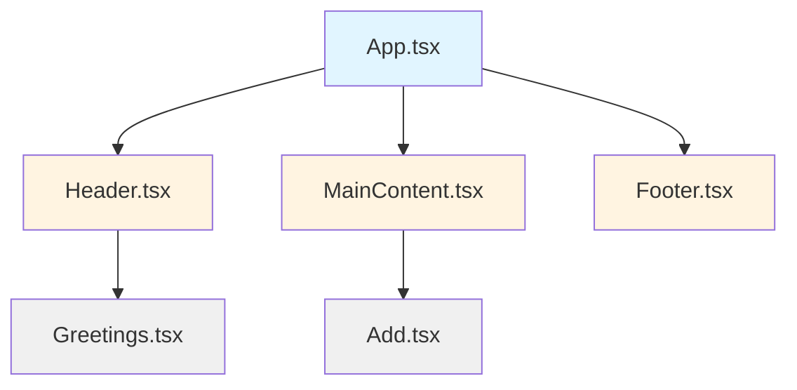

# 04 - Multiple Components / Nhiều Component

## 📖 English

### Description

This exercise demonstrates how to create multiple components and compose them together by nesting components within each other. You'll learn the fundamental concept of component composition, which is at the heart of React's architecture.

### 🎯 Learning Objectives

- Creating multiple separate components
- Understanding component composition and nesting
- Importing and exporting components
- Building a typical webpage layout with React components
- Organizing components in a separate directory
- Using both function declaration and arrow function syntax

### 🏗️ Project Structure

```
src/
├── components/
│   ├── Header.tsx         # Header with navigation (nests Greetings)
│   ├── Greetings.tsx      # Nested greeting component
│   ├── MainContent.tsx    # Main content area (nests Add)
│   ├── Add.tsx            # Nested utility component
│   └── Footer.tsx         # Footer with copyright
├── App.tsx                # Main app composing all components
└── main.tsx              # Application entry point
```

### 📦 Components

#### 1. App Component
**File**: [`App.tsx`](./src/App.tsx)

The root component that composes the entire page layout.

**Features**:
- Imports three main layout components
- Renders them in a logical order (Header → MainContent → Footer)
- Uses React Fragment (`<>`) as container

**Code**:
```typescript
import Header from "./components/Header";
import MainContent from "./components/MainContent";
import Footer from "./components/Footer";

function App() {
  return (
    <>
      <Header />
      <MainContent />
      <Footer />
    </>
  )
}

export default App
```

#### 2. Header Component (Parent)
**File**: [`Header.tsx`](./src/components/Header.tsx)

The page header containing navigation and a nested `Greetings` component.

**Features**:
- Demonstrates **component nesting** by including `<Greetings />`
- Contains semantic HTML (`<header>`, `<nav>`)
- Displays website title and navigation links

**Code**:
```typescript
import Greetings from "./Greetings";

const Header = () => {
    return (
        <header>
            <h1>Welcome to My Website!</h1>
            <Greetings />
            <nav>
                <a href="https://github.com/richard-vu">Home</a>
                <a href="https://github.com/richard-vu">About</a>
                <a href="https://github.com/richard-vu">Contact</a>
            </nav>
        </header>
    );
};

export default Header;
```

#### 3. Greetings Component (Child)
**File**: [`Greetings.tsx`](./src/components/Greetings.tsx)

A simple component nested inside `Header`.

**Features**:
- Demonstrates a **child component**
- Shows how components can be reusable pieces
- Simple arrow function component

**Code**:
```typescript
const Greetings = () => {
    return <div>Greetings</div>;
};

export default Greetings;
```

#### 4. MainContent Component (Parent)
**File**: [`MainContent.tsx`](./src/components/MainContent.tsx)

The main content area of the page, nesting an `Add` component.

**Features**:
- Demonstrates **component nesting** by including `<Add />`
- Uses semantic `<main>` element
- Combines nested component with regular content

**Code**:
```typescript
import Add from "./Add";

const MainContent = () => {
    return (
        <main>
            <h2>Main Content</h2>
            <Add />
            <p>This is the main content.</p>
        </main>
    );
};

export default MainContent;
```

#### 5. Add Component (Child)
**File**: [`Add.tsx`](./src/components/Add.tsx)

A simple component nested inside `MainContent`.

**Features**:
- Another example of a **child component**
- Demonstrates modularity

**Code**:
```typescript
const Add = () => {
    return <div>Add</div>;
};

export default Add;
```

#### 6. Footer Component
**File**: [`Footer.tsx`](./src/components/Footer.tsx)

The page footer with copyright information.

**Features**:
- Uses traditional `function` declaration (vs arrow function)
- Shows alternative component syntax
- Semantic `<footer>` element

**Code**:
```typescript
function Footer() {
    return (
        <footer>
            <p>© 2025 My Website</p>
        </footer>
    )
}

export default Footer
```

### 💡 Key Concepts Learned

#### 1. Component Composition
The ability to nest components inside other components:
```typescript
// Parent component
const Header = () => {
    return (
        <header>
            <h1>Title</h1>
            <Greetings />  {/* Child component */}
        </header>
    );
};
```

#### 2. Component Hierarchy
Your application has a clear component tree:
```
App
├── Header
│   └── Greetings
├── MainContent
│   └── Add
└── Footer
```

#### 3. Import/Export Pattern
Each component is isolated in its own file:
```typescript
// Export from component file
export default Header;

// Import in parent component
import Header from "./components/Header";
```

#### 4. Function Syntax Variations
React components can be defined using different syntaxes:

| Syntax | Example | Used In |
|--------|---------|---------|
| Arrow Function | `const Header = () => { ... }` | Header, MainContent, Greetings, Add |
| Function Declaration | `function Footer() { ... }` | Footer |
| Named Export | `export default App` | App |

Both are valid and produce the same result!

### 🎨 Component Organization Benefits

> [!TIP]
> **Why separate files for each component?**
> - **Reusability**: Components can be imported and used anywhere
> - **Maintainability**: Easier to find and update specific components
> - **Testability**: Each component can be tested independently
> - **Collaboration**: Multiple developers can work on different components
> - **Code clarity**: Smaller files are easier to understand

### 📊 Component Relationships



**Legend**:
- **Blue** (App): Root component
- **Yellow** (Header, MainContent, Footer): Main layout components
- **Gray** (Greetings, Add): Nested child components

### ⚠️ Best Practices

> [!IMPORTANT]
> **Component File Naming**:
> - Use PascalCase for component files: `Header.tsx`, not `header.tsx`
> - Match the filename to the component name
> - Use `.tsx` extension for TypeScript + JSX files

> [!NOTE]
> **Default Exports**:
> Each component uses `export default`, which allows importing with any name:
> ```typescript
> import Header from "./Header";      // ✅ Recommended
> import MyHeader from "./Header";    // ✅ Also works, but confusing
> ```
> For clarity, always import with the same name as the component.

### 🚀 Running the Project

1. Install dependencies:
   ```bash
   npm install
   # or
   yarn install
   ```

2. Start the development server:
   ```bash
   npm run dev
   # or
   yarn dev
   ```

3. Open your browser to the displayed local URL (typically `http://localhost:5173`)

### 🔄 How It Works

1. **React starts** by rendering `App` component
2. **App renders** `Header`, `MainContent`, and `Footer`
3. **Header renders** its content plus `Greetings` component
4. **MainContent renders** its content plus `Add` component
5. **Footer renders** its simple content
6. **Result**: A complete webpage built from composable pieces!

### 📚 Additional Resources

- [Your First Component - React](https://react.dev/learn/your-first-component)
- [Importing and Exporting Components - React](https://react.dev/learn/importing-and-exporting-components)
- [Composition vs Inheritance - React](https://react.dev/learn/thinking-in-react#step-1-break-the-ui-into-a-component-hierarchy)

---

## 📖 Tiếng Việt

### Mô tả

Bài tập này minh họa cách tạo nhiều component và kết hợp chúng lại với nhau bằng cách lồng các component vào trong nhau. Bạn sẽ học khái niệm cơ bản về component composition, đây là nền tảng của kiến trúc React.

### 🎯 Mục tiêu Học tập

- Tạo nhiều component riêng biệt
- Hiểu về component composition và nesting
- Import và export các component
- Xây dựng layout webpage điển hình với React components
- Tổ chức các component trong thư mục riêng
- Sử dụng cả cú pháp function declaration và arrow function

### 🏗️ Cấu trúc Dự án

```
src/
├── components/
│   ├── Header.tsx         # Header với navigation (lồng Greetings)
│   ├── Greetings.tsx      # Component greeting lồng nhau
│   ├── MainContent.tsx    # Khu vực nội dung chính (lồng Add)
│   ├── Add.tsx            # Component tiện ích lồng nhau
│   └── Footer.tsx         # Footer với copyright
├── App.tsx                # App chính kết hợp tất cả component
└── main.tsx              # Điểm vào ứng dụng
```

### 📦 Các Component

#### 1. Component App
**File**: [`App.tsx`](./src/App.tsx)

Component gốc kết hợp toàn bộ layout trang.

**Tính năng**:
- Import ba component layout chính
- Render chúng theo thứ tự logic (Header → MainContent → Footer)
- Sử dụng React Fragment (`<>`) làm container

**Code**:
```typescript
import Header from "./components/Header";
import MainContent from "./components/MainContent";
import Footer from "./components/Footer";

function App() {
  return (
    <>
      <Header />
      <MainContent />
      <Footer />
    </>
  )
}

export default App
```

#### 2. Component Header (Parent)
**File**: [`Header.tsx`](./src/components/Header.tsx)

Header của trang chứa navigation và component `Greetings` lồng bên trong.

**Tính năng**:
- Minh họa **component nesting** bằng cách bao gồm `<Greetings />`
- Chứa semantic HTML (`<header>`, `<nav>`)
- Hiển thị tiêu đề website và các link navigation

**Code**:
```typescript
import Greetings from "./Greetings";

const Header = () => {
    return (
        <header>
            <h1>Welcome to My Website!</h1>
            <Greetings />
            <nav>
                <a href="https://github.com/richard-vu">Home</a>
                <a href="https://github.com/richard-vu">About</a>
                <a href="https://github.com/richard-vu">Contact</a>
            </nav>
        </header>
    );
};

export default Header;
```

#### 3. Component Greetings (Child)
**File**: [`Greetings.tsx`](./src/components/Greetings.tsx)

Component đơn giản lồng bên trong `Header`.

**Tính năng**:
- Minh họa một **child component**
- Cho thấy cách các component có thể là các phần tử tái sử dụng
- Component arrow function đơn giản

**Code**:
```typescript
const Greetings = () => {
    return <div>Greetings</div>;
};

export default Greetings;
```

#### 4. Component MainContent (Parent)
**File**: [`MainContent.tsx`](./src/components/MainContent.tsx)

Khu vực nội dung chính của trang, lồng component `Add` bên trong.

**Tính năng**:
- Minh họa **component nesting** bằng cách bao gồm `<Add />`
- Sử dụng phần tử semantic `<main>`
- Kết hợp component lồng nhau với nội dung thông thường

**Code**:
```typescript
import Add from "./Add";

const MainContent = () => {
    return (
        <main>
            <h2>Main Content</h2>
            <Add />
            <p>This is the main content.</p>
        </main>
    );
};

export default MainContent;
```

#### 5. Component Add (Child)
**File**: [`Add.tsx`](./src/components/Add.tsx)

Component đơn giản lồng bên trong `MainContent`.

**Tính năng**:
- Ví dụ khác về **child component**
- Minh họa tính modular

**Code**:
```typescript
const Add = () => {
    return <div>Add</div>;
};

export default Add;
```

#### 6. Component Footer
**File**: [`Footer.tsx`](./src/components/Footer.tsx)

Footer của trang với thông tin copyright.

**Tính năng**:
- Sử dụng khai báo `function` truyền thống (vs arrow function)
- Cho thấy cú pháp component thay thế
- Phần tử semantic `<footer>`

**Code**:
```typescript
function Footer() {
    return (
        <footer>
            <p>© 2025 My Website</p>
        </footer>
    )
}

export default Footer
```

### 💡 Các Khái niệm Chính Đã Học

#### 1. Component Composition
Khả năng lồng các component vào trong các component khác:
```typescript
// Component cha
const Header = () => {
    return (
        <header>
            <h1>Title</h1>
            <Greetings />  {/* Component con */}
        </header>
    );
};
```

#### 2. Cấu trúc Component
Ứng dụng của bạn có cây component rõ ràng:
```
App
├── Header
│   └── Greetings
├── MainContent
│   └── Add
└── Footer
```

#### 3. Pattern Import/Export
Mỗi component được tách riêng trong file riêng:
```typescript
// Export từ file component
export default Header;

// Import trong component cha
import Header from "./components/Header";
```

#### 4. Các Biến thể Cú pháp Function
Các component React có thể được định nghĩa bằng các cú pháp khác nhau:

| Cú pháp | Ví dụ | Được dùng trong |
|---------|-------|-----------------|
| Arrow Function | `const Header = () => { ... }` | Header, MainContent, Greetings, Add |
| Function Declaration | `function Footer() { ... }` | Footer |
| Named Export | `export default App` | App |

Cả hai đều hợp lệ và tạo ra kết quả giống nhau!

### 🎨 Lợi ích của Tổ chức Component

> [!TIP]
> **Tại sao tách file cho mỗi component?**
> - **Tái sử dụng**: Component có thể được import và sử dụng ở bất cứ đâu
> - **Bảo trì dễ dàng**: Dễ tìm và cập nhật các component cụ thể
> - **Khả năng test**: Mỗi component có thể được test độc lập
> - **Cộng tác**: Nhiều developer có thể làm việc trên các component khác nhau
> - **Code rõ ràng**: File nhỏ hơn dễ hiểu hơn

### 📊 Mối quan hệ Component


**Chú thích**:
- **Xanh** (App): Component gốc
- **Vàng** (Header, MainContent, Footer): Các component layout chính
- **Xám** (Greetings, Add): Các component con lồng nhau

### ⚠️ Best Practices

> [!IMPORTANT]
> **Đặt tên File Component**:
> - Sử dụng PascalCase cho file component: `Header.tsx`, không phải `header.tsx`
> - Tên file phải khớp với tên component
> - Sử dụng extension `.tsx` cho file TypeScript + JSX

> [!NOTE]
> **Default Exports**:
> Mỗi component sử dụng `export default`, cho phép import với bất kỳ tên nào:
> ```typescript
> import Header from "./Header";      // ✅ Được khuyến nghị
> import MyHeader from "./Header";    // ✅ Cũng hoạt động, nhưng gây nhầm lẫn
> ```
> Để rõ ràng, luôn import với cùng tên với component.

### 🚀 Chạy Dự án

1. Cài đặt dependencies:
   ```bash
   npm install
   # hoặc
   yarn install
   ```

2. Khởi động development server:
   ```bash
   npm run dev
   # hoặc
   yarn dev
   ```

3. Mở trình duyệt tới URL local hiển thị (thường là `http://localhost:5173`)

### 🔄 Cách Hoạt động

1. **React bắt đầu** bằng cách render component `App`
2. **App render** `Header`, `MainContent`, và `Footer`
3. **Header render** nội dung của nó cộng với component `Greetings`
4. **MainContent render** nội dung của nó cộng với component `Add`
5. **Footer render** nội dung đơn giản của nó
6. **Kết quả**: Một trang web hoàn chỉnh được xây dựng từ các phần có thể kết hợp!

### 📚 Tài liệu Tham khảo

- [Your First Component - React](https://react.dev/learn/your-first-component)
- [Importing and Exporting Components - React](https://react.dev/learn/importing-and-exporting-components)
- [Composition vs Inheritance - React](https://react.dev/learn/thinking-in-react#step-1-break-the-ui-into-a-component-hierarchy)

---

**Created**: 2025-12-29  
**Tech Stack**: React 18 + TypeScript + Vite